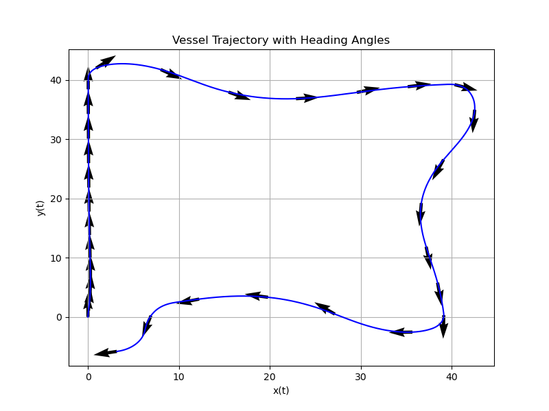
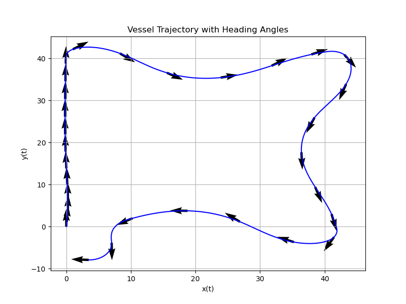
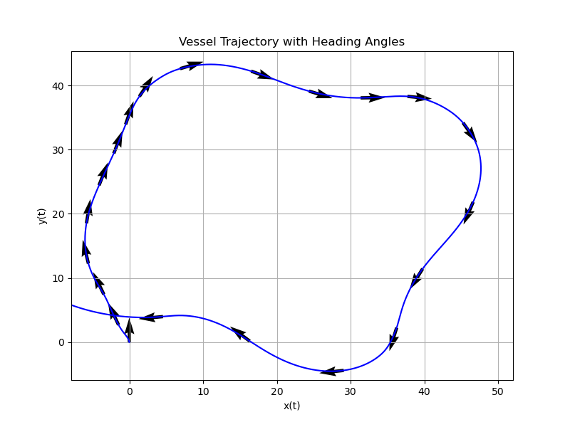

# Marine Vessel Simulator

This repository contains code for simulation of marine vessels.
The "Handbook of Marine Craft Hydrodynamics and Motion Control" by Thor I. Fossen was used actively for theoretical background material, as well as papers mentioned in the "placeholder.pdf" in the literature folder. 

The repository is implemented using c++ for fast computations and open-source purposes. 

#### Implemented models;
- ran(), a marine reserch vessel with a catamaran hull.

#### Implemented path generation algorithms;
- Straight line path. (For path following.)
- Continuous-curvature path based on "Continuous-Curvature Path Generation Using Fermat's Spiral" by Anastasios M. Lekkas, Andreas R. Dahl, Morten Breivik, Thor I. Fossen. In Modeling, Identification and Control, Vol. 34, No. 4, 2013, pp. 183–198, ISSN 1890–1328. (For path following and trajectory tracking.)

#### Implemented guidance laws; 
- Dynamic positioning (DP) (at stationary waypoint).
- Line-of-sight (LOS).
- Adaptive Line-of-sight (ALOS). 

#### Motion Control
- PID for force (surge X and sway Y) and moment (yaw N) control.
- Heading PID based on Nomoto model. 

#### Control Allocation
- Nonlinear constrained optimization using Casadi.
- TODO: MPC using Casadi.

## Pictures of performance

#### Straight-line path following using LOS, Heading PID and nonlinear constrained optimization. 

#### Straight-line path following using ALOS, Heading PID and nonlinear constrained optimization. 

#### Fermat's Spiral path following using LOS, Heading PID and nonlinear constrained optimization. 

#### Fermat's Spiral path following using ALOS, Heading PID and nonlinear constrained optimization. 

## TODO:
 
 #### Fix calculation ran()
 Fix the calculation of input matrix B in ran().
 Check that the numbers used in equations make sence for ran. 

 #### MPC control allocation to handle time delay of actuators better

 #### MPC guidance 1: 
 For DP mainly. 
 MPC using control allocation knowlegde, to improve performance over a horizon.
 
 #### MPC guidance 2
 For path following/trajectory tracking
 Can be calculated by a thread in the background and updated once in a while.

 Minimization based on the inputs 
 - chi_d (Desired Course angle)
 - U_d (Desired speed)
 - Tf (final time)

 chi = psi + beta_c 
 U = sqrt(u² + v²)
 beta_c = atan(v/u)
 
 Finding:
 X_d_dot = U_d * cos(chi_d)
 Y_d_dot = U_d * sin(chi_d)

 Inequality Constraints:
 abs(chi_d[k+1] - chi_d[k]) / h <= r_max (max turning)
 abs(U_d[k+1] - U_d[k]) / h <= U_dot_max (max desired acceleration)

 Equality constraints:
 X_d(0)
 Y_d(0)
 X_d(Tf)
 Y_d(Tf)
 Tf = 60 seconds (example value)
