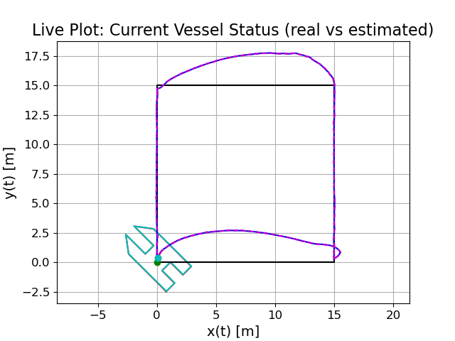
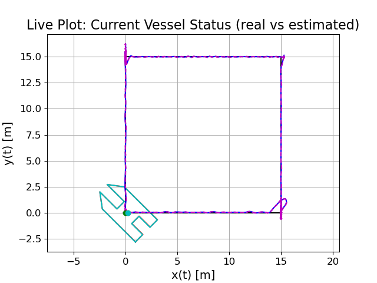
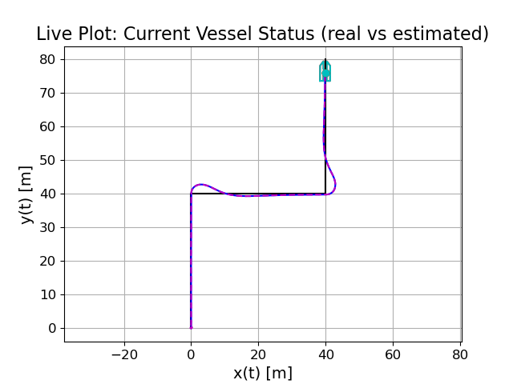
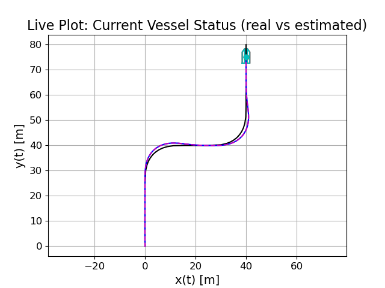

# Marine Vessel Simulator

This repository contains c++ code for simulation of a USV, named RAN.

The "Handbook of Marine Craft Hydrodynamics and Motion Control" by Thor I. Fossen was used actively for theoretical background material, as well as papers mentioned in "Optimal_Constrained_Control_Allocation_for_catamarans_with_dual_azimuth_thrusters.pdf" under the literature folder. 

The repository is implemented using c++ for fast computations and open-source purposes. 

#### Models;
- ran(), a marine reserch vessel with a catamaran hull, with one azimuth pod placed aft underneeth each hull. 

#### Sensors simulation;
The follwing sensors are simulated using the model states and their derivatives as input.
- IMU (for gyroscope and acceleration measurements)
- GNSS anenna (for position measurements)

#### Observers;
The following observers are implemented for full 12 state estimation using IMU and gnss sensors measurements;
- EKF12: Only estimating the states themselves
- EKF18: EKF12 with bias estimation 

#### Path generation algorithms;
- Straight line path.
- Continuous-curvature path based on "Continuous-Curvature Path Generation Using Fermat's Spiral" by Anastasios M. Lekkas, Andreas R. Dahl, Morten Breivik, Thor I. Fossen. In Modeling, Identification and Control, Vol. 34, No. 4, 2013, pp. 183–198, ISSN 1890–1328. (For path following and trajectory tracking)

#### Guidance laws; 
- Dynamic positioning (DP)
- Line-of-sight (LOS).
- Adaptive Line-of-sight (ALOS). 

#### Motion Controllers
- MIMO PID for force (surge X and sway Y) and moment (yaw N) control.
- Heading PID based on Nomoto model. 

#### Control Allocation Methods
- Pseudo-iverse
- Nonlinear constrained optimization
- MPC Thrust model
- MPC Full model 

#### Plotting
- Plotting functions for vizualizing stored data.
- Live plotting showing disired path in black, true vessel movements in red, estimated vessel movements in Light Cyan and the vessels current projection on the path in green. 

### Showcase form Live plotting: 
A few examples showcasing live plotting and system performance.

Four square test: 
1. Move forwards with 0 deg HDG
2. Move sideways with 0 deg HDG
3. Move backwards with 0 deg HDG
4. Move sideways with 45 deg HDG
<table>
  <tr>
    <td>
      
      
Live, 4 square test, DP, POD Model MPC Control allocation

    </td>
    <td>
      
      
Live, 4 square test, DP, Full Model MPC Control allocation

    </td>
  </tr>
<table>

Path following:
<table>
  <tr>
    <td>
      
      
Live, Straight path, LOS, POD Model Control allocation

    </td>
    <td>
      
      
Live, Curved path, LOS, POD Model Control allocation

    </td>
  </tr>
</table>

