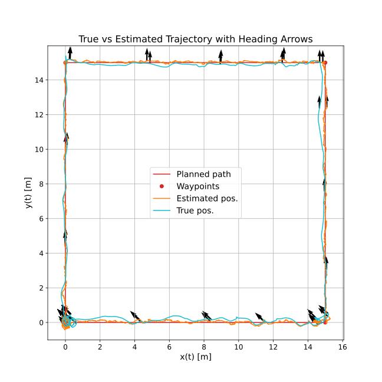
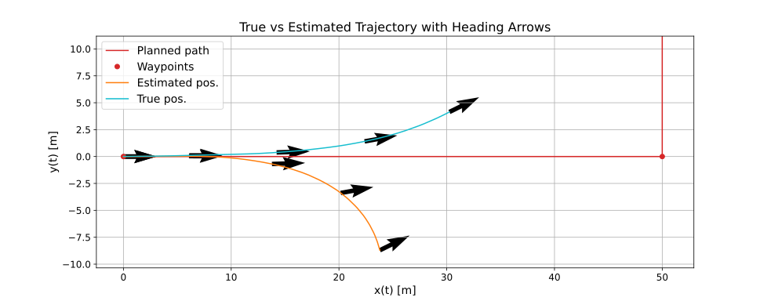
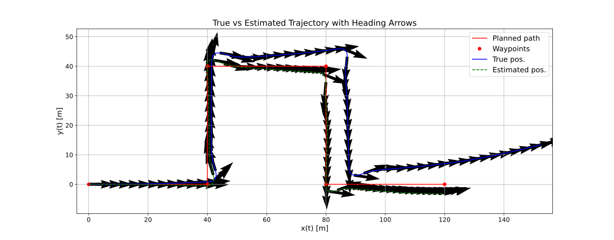

# Marine Vessel Simulator

This repository contains c++ code for simulation of a USV, named RAN.

The "Handbook of Marine Craft Hydrodynamics and Motion Control" by Thor I. Fossen was used actively for theoretical background material, as well other sources mentioned in dokuments in under the literature folder. 

The repository is implemented using c++ for fast computations and open-source purposes. 

#### Models;
- ran(), a marine reserch vessel with a catamaran hull, with one azimuth pod placed aft underneeth each hull. 

#### Sensors simulation;
The follwing sensors are simulated using the model states and their derivatives as input.
- IMU (for gyroscope and acceleration measurements)
- GNSS anenna (for position measurements)

#### Observers;
The following observers are implemented for full (12) state estimation using IMU and GNSS antenna measurements;
- EKF15: 
  - Estimating: postion (3), velocity (3), attitude (Euler: 3), accel. bias (3) and gyro bias (3). 
  - Attitude rates are given directly by gyro. using bias compansation.
- Nav. System with velocity aiding from neural net ensemble: 
  - Using 9-state ekf for position, velocity and accel. bias estimation. 
  - Using nonlinear attitude observer for attitude and gyro bias estimation.
  - Using an ensemble of neural networks trained on path following data from simulation, for velocity aiding the 9-state ekf. 
  - Using the velocity aiding provides substancial improvements to the navigation system dead reckoning performance.

#### Path generation algorithms;
- Straight line path.
- Continuous-curvature path based on "Continuous-Curvature Path Generation Using Fermat's Spiral" by Anastasios M. Lekkas, Andreas R. Dahl, Morten Breivik, Thor I. Fossen. In Modeling, Identification and Control, Vol. 34, No. 4, 2013, pp. 183–198, ISSN 1890–1328. (For path following and trajectory tracking)

#### Guidance laws; 
- Dynamic positioning (DP)
- Line-of-sight (LOS).
- Adaptive Line-of-sight (ALOS). 

#### Motion Controllers
- MIMO PID for force (surge X and sway Y) and moment (yaw N) control.
- Heading Autopilot based on Nomoto model. 

#### Control Allocation Methods
- Pseudo-iverse (not recomended) (for path following)
- Nonlinear constrained optimization (for path following)
- MPC Thrust model (for path following / DP and berthing)
- MPC Full model (for DP and berthing)

#### Plotting
- Plotting functions for vizualizing stored data.
- Live plotting showing disired path in black, true vessel movements in red, estimated vessel movements in Light Cyan and the vessels current projection on the path in green. 

### Small Showcase: 
A few examples showcasing capabilities. Look at documents in the literature folder for more. 

#### Path following:
<table>
  <tr>
    <td>
      
      
Straight path

    </td>
    <td>
      
      
Curved Fermat spiral path 

    </td>
  </tr>
</table>

#### Docking:
Four square test: 
1. Move forwards with 0 deg HDG
2. Move sideways with 0 deg HDG
3. Move backwards with 0 deg HDG
4. Move sideways with -45 deg HDG
<table>
  <tr>
    <td>
      
      
Live, 4 square test, DP, POD Model MPC Control allocation

    </td>
<table>

#### Navigation system performance with and without velocity aiding under dead-reconing:
<table>
  <tr>
    <td align="center">
       
      Dead reckoning: True vs. estimated vessel states (pos and hdg) without velocity aiding.
    </td>
  </tr>
  <tr>
    <td align="center">
       
      Dead reckoning: True vs. estimated vessel states (pos and hdg) using velocity aiding.
    </td>
  </tr>
</table>
